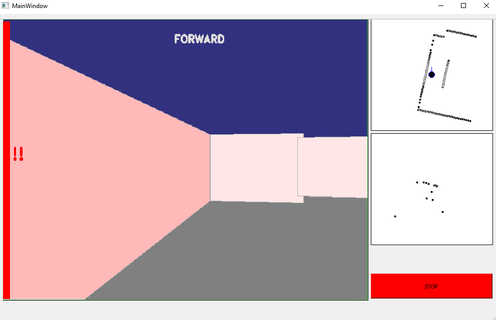
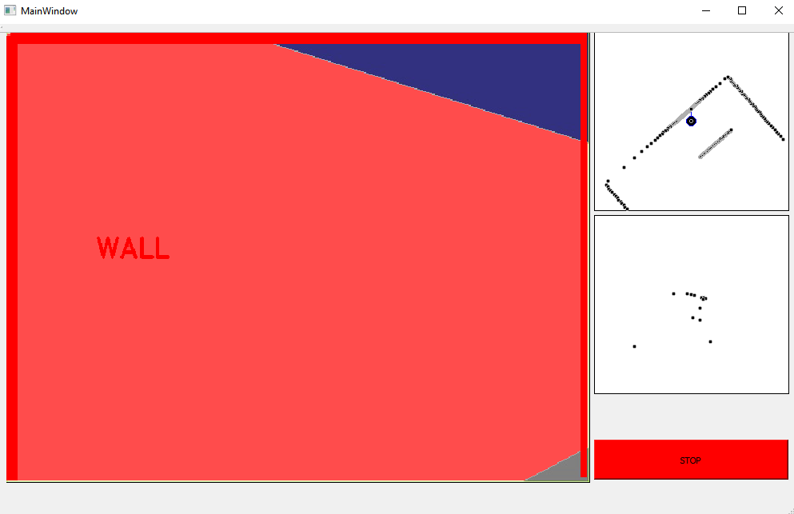
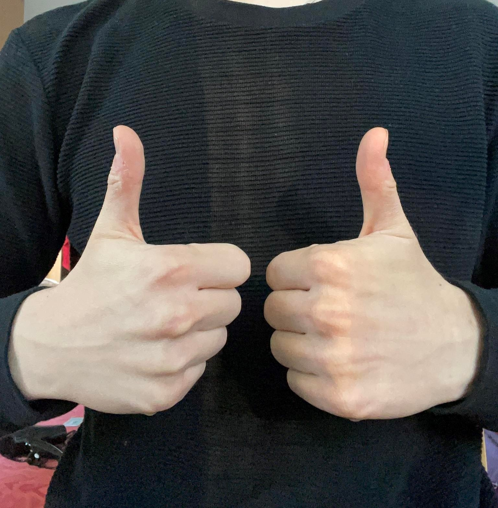
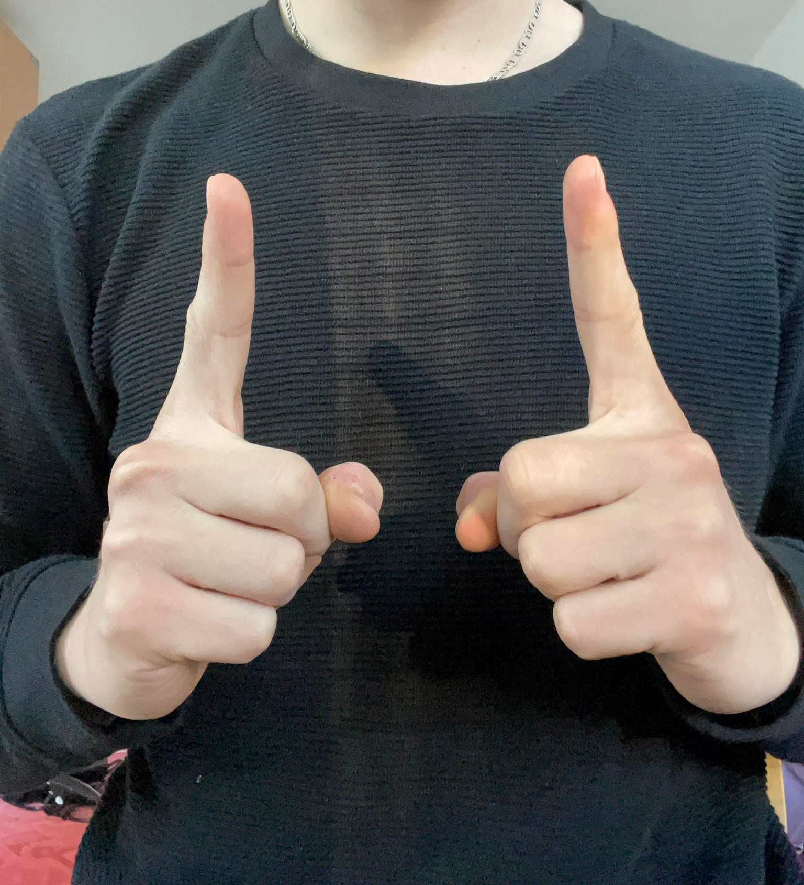
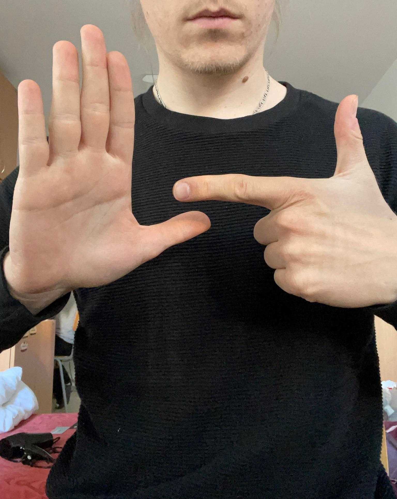
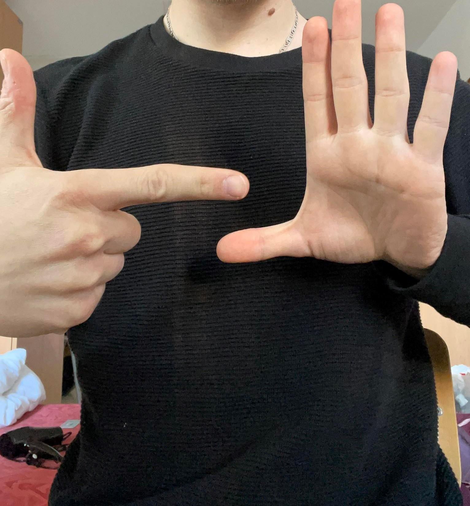
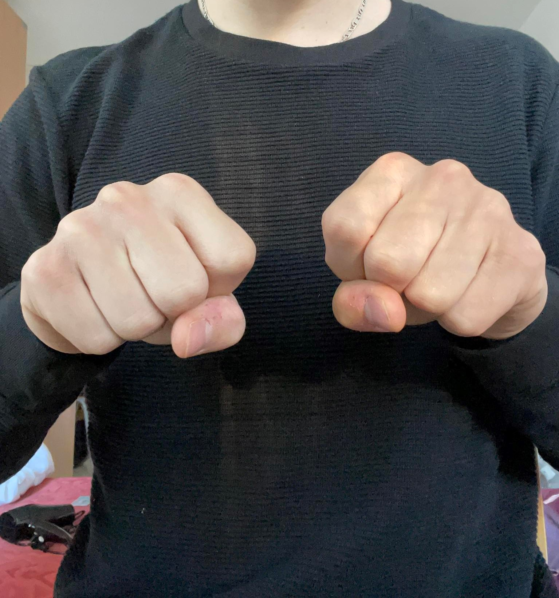

# HMI #

Táto úloha je implementovaná do demo príkladu, ktorý sme dostali ako podklad k predmetu.

## Zadanie ##

    Priame tele-riadenie robota. Používateľ má možnosť ovládať robota priamo gestami alebo
    pomocou klávesnice

### Používateľské prostredie ###

    Hlavným prvkom HMI je obraz kamery umiestnenej na robotovi. V obraze kamery je umiestnených
    viacero prvkov, ktoré operátora informujú o aktuálnom stave. Na prvom obrázku vo vrchnej časti 
    kamery vidíme výpis "FORWARD". Informuje operátora o aktuálnom príkaze, ktorý robot vykonáva.
    Ak by sme zvolili rotáciu, videli by sme výpis "LEFT"/"RIGHT" v ľavej alebo pravej časti obrazovky.

    Po všetkych 4 stranách kamery sa môžu zobrazovať červené čiary, ktoré menia svoju hrúbku. Tieto
    čiary upozorňujú operátora na blížiacu sa prekážku na danej strane. Čím je robot bližšie k pre-
    kážke, tým je čiara na danej strane hrubšia. Keď robot prekročí bezpečnú vzdialenosť od steny,
    zobrazí sa operátorovi ďalšia výstražná hláška, ktorá má dva formáty:
    - forma hlásenia "!!" na ľavej/pravej strane, oznamuje operátorovi prekážku, ktorá je mimo zorného
      pola robota (1. obrázok)
    - forma hlásenia "WALL" na najbližšom bode steny, oznamuje operátorovi prekážku, ktorá je 
      v zornom poly robota (2. obrázok)

    V pravej časti HMI máme následne ďaľšie dve obrazovky. Jedna zobrazuje body detegovaného skeletonu
    (spodná), druhá zobrazuje lidarové dáta. V obrazovky s lidarovými dátami máme možnosť vidieť aj 
    pozíciu a natočenie robota, takže operátor má lepší prehľad o prostredí, v ktorom sa robot nachá-
    dza (dokáže vidieť aj prekážky mimo zorného pola kamery, ktoré bez natočenia robota nevie zachytiť).
    Veľmi dôležité je tlačidlo STOP, čo je tlačidlo centrálneho zastavenia. Po jeho stlačení robot zastane.

### Ovládanie ###

- centrálne tlačidlo STOP

- pomocou AWSD na klávesnici

- pomocou gést\
        1. gesto vpred
        - 
        2. gesto vzad
        - 
        3. gesto vľavo  
        - 
        4. gesto vpravo
        - 
        5. gesto stoj
        - 

    
